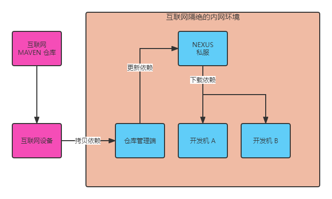
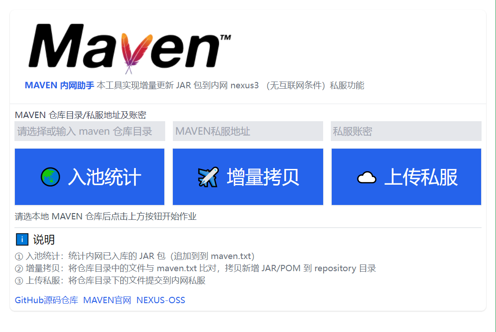

<h1>🎉 MAVEN 内网助手 🎉</h1>

本工具辅助增量更新 JAR 包到内网 nexus3 （无互联网条件）私服。

**场景**

公司研发团队在内网搭建 nexus3 maven 私服，由于没有互联网，需要更新依赖包的做法通常是：

1. 在外网机器下载好所需依赖
2. 将上述依赖包拷贝到内网机器（最好是只拷贝增量包，不然每次几个 G 的拷贝非常耗时）
3. 在内网机器（通常是 windows）将依赖包导入到 nexus

## 功能 / FEATURE 🎉

✅ 统计已入库的 JAR 包（将仓库下文件按行写入 maven.txt）

✅ 比对指定目录（通常时外网机器），找到未入库（不在 maven.txt 内）的文件（增量）并复制到 `repository`

✅ 将指定目录下的文件提交到内网 `nexus` 私服

## 使用方法 / HOW-TO-USE 📖

### 命令行方式

执行 `node index.js -H` 查看说明

**涉及文件**

文件名|说明
-|-
index.js|入口程序
maven.js|功能实现

### GUI 方式（基于 Electron）

**涉及文件**

文件名|说明
-|-
index.html|入口页面（引用 [tailwindcss](https://github.com/tailwindlabs/tailwindcss)）
webworker.js|WebWorker 封装（便于浏览器页面丝滑更新）
maven.js|功能实现

